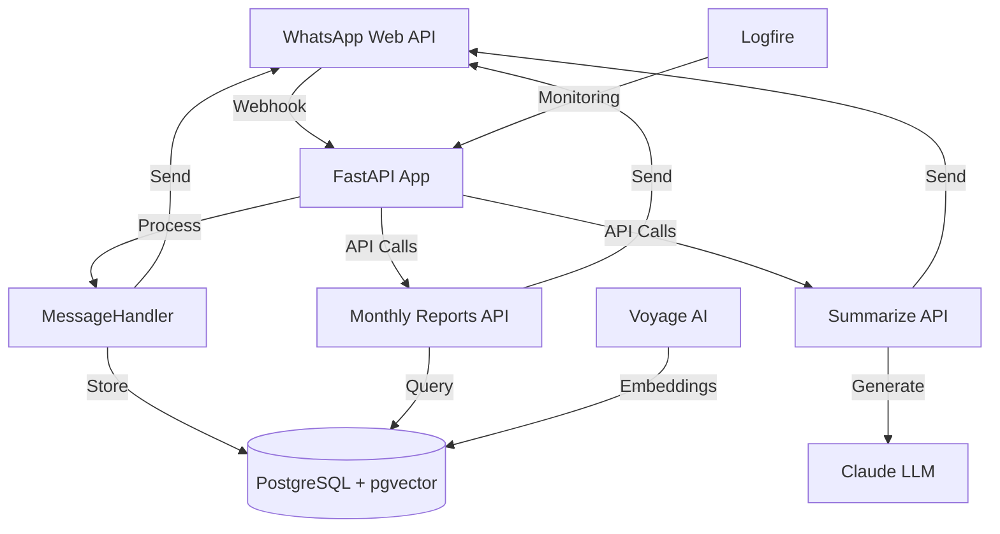
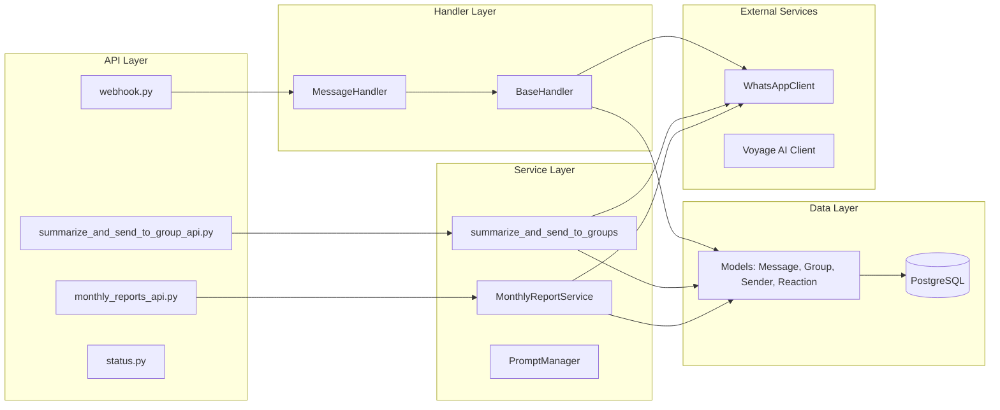
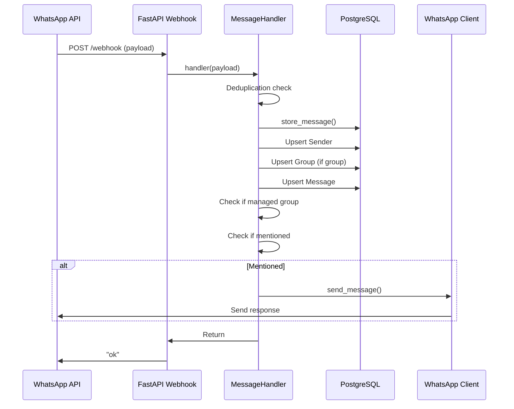
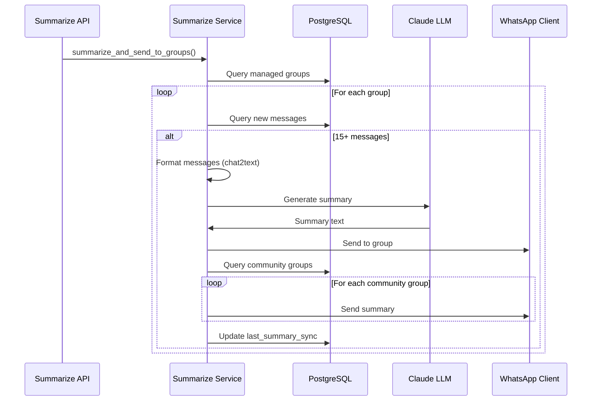
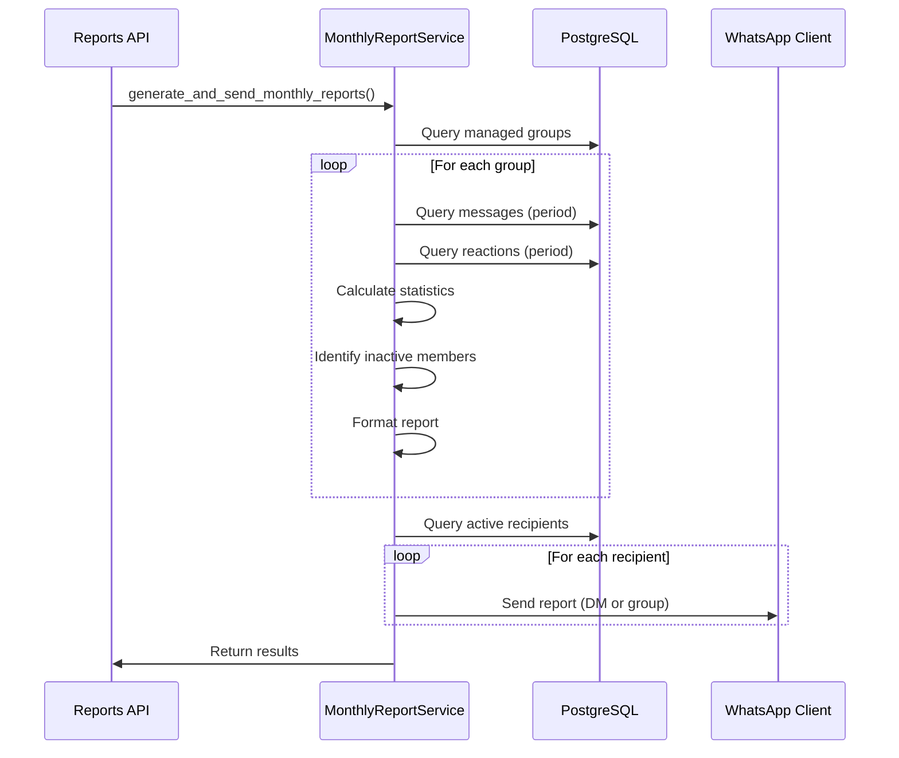

# Repository Summary and Architecture Documentation

## Overview

**wa_engage** is an AI-powered WhatsApp bot that tracks group conversations, generates intelligent summaries, and provides monthly activity reports. The system integrates with WhatsApp Web API, uses PostgreSQL with pgvector for message storage, and leverages LLM (Claude via Anthropic) for summarization and Voyage AI for embeddings.

## Core Features

1. **Message Tracking**: Stores all WhatsApp messages, reactions, and metadata in PostgreSQL
2. **Group Management**: Tracks groups, manages "managed" groups, and supports community group relationships
3. **AI Summarization**: Generates conversation summaries using Claude Sonnet 4.5 for groups with sufficient activity (15+ messages)
4. **Monthly Reports**: Generates activity reports identifying inactive members and sends to registered recipients
5. **Webhook Processing**: Real-time message processing via FastAPI webhook endpoint
6. **Direct Message Handling**: Optional auto-reply for DMs
7. **Opt-out Feature**: Users can opt-out of being tagged in bot-generated messages

## Technology Stack

- **Framework**: FastAPI (async Python web framework)
- **Database**: PostgreSQL with pgvector extension (for vector embeddings)
- **ORM**: SQLModel (SQLAlchemy + Pydantic)
- **Migrations**: Alembic
- **LLM**: Anthropic Claude Sonnet 4.5 (via Pydantic AI)
- **Embeddings**: Voyage AI
- **Monitoring**: Logfire (instrumentation for FastAPI, SQLAlchemy, httpx, Pydantic AI)
- **WhatsApp Integration**: Custom HTTP client for WhatsApp Web API
- **Testing**: pytest, pytest-asyncio, pytest-cov
- **Code Quality**: ruff (linting/formatting), pyright (type checking)
- **Task Runner**: Poe the Poet

## Architecture Overview

### High-Level Architecture

### Component Architecture

## Key Components

### 1. Application Entry Point (`app/main.py`)

- Initializes FastAPI app with lifespan context manager
- Sets up database connection pool (asyncpg, SQLAlchemy async)
- Initializes WhatsApp client and Voyage AI embedding client
- Configures Logfire instrumentation
- Starts background task to gather groups from WhatsApp
- Registers API routers

### 2. API Layer (`src/api/`)

**webhook.py**: Receives WhatsApp webhook payloads and processes messages
- POST `/webhook` - Main webhook endpoint

**summarize_and_send_to_group_api.py**: Triggers summarization for all managed groups
- POST `/summarize_and_send_to_groups` - Manual trigger for summarization

**monthly_reports_api.py**: Monthly activity report generation and recipient management
- POST `/monthly_reports/generate` - Generate and send reports
- POST `/monthly_reports/recipients` - Register recipient
- GET `/monthly_reports/recipients` - List recipients
- DELETE `/monthly_reports/recipients/{jid}` - Deactivate recipient

**status.py**: Health check endpoint
- GET `/status` - Application status

**deps.py**: FastAPI dependency injection
- `get_db_async_session` - Database session with auto-commit/rollback
- `get_whatsapp` - WhatsApp client instance
- `get_text_embebedding` - Voyage AI client instance
- `get_handler` - MessageHandler factory

### 3. Handler Layer (`src/handler/`)

**BaseHandler** (`base_handler.py`):
- Base class for message processing
- `store_message()` - Stores messages and reactions in DB
- `store_reaction()` - Handles reaction webhooks
- `send_message()` - Sends messages via WhatsApp and stores them
- `upsert()` - Generic upsert helper for models

**MessageHandler** (`__init__.py`):
- Extends BaseHandler
- Processes incoming webhook payloads
- Implements deduplication (TTL cache, 4-minute TTL)
- Handles direct messages (optional auto-reply)
- Filters unmanaged groups
- Responds to mentions with informational message

### 4. Data Models (`src/models/`)

**Message** (`message.py`):
- Stores WhatsApp messages with text, media, timestamps
- Relationships: sender, group, replies, reactions
- Extracts text from various content types (image captions, video captions, etc.)
- Handles JID normalization and group detection

**Group** (`group.py`):
- Tracks WhatsApp groups
- Fields: `managed` (boolean), `community_keys` (array), `last_summary_sync`
- Method: `get_related_community_groups()` - Finds groups sharing community keys

**Sender** (`sender.py`):
- Stores user information (JID, push_name)
- Relationships: messages, groups_owned

**Reaction** (`reaction.py`):
- Stores message reactions
- Links to message and sender

**ReportRecipient** (`report_recipient.py`):
- Stores recipients for monthly reports
- Can be user JID (DM) or group JID
- Tracks active/inactive status

**Webhook Models** (`webhook.py`):
- Pydantic models for WhatsApp webhook payloads
- Handles various message types and reactions

### 5. WhatsApp Client (`src/whatsapp/`)

**BaseClient** (`base_client.py`):
- HTTP client wrapper using httpx
- Handles basic auth, timeouts, error handling

**WhatsAppClient** (`client.py`):
- Composed from mixins: AppMixin, UserMixin, MessageMixin, GroupMixin, NewsletterMixin
- Provides methods for sending messages, getting JID, group operations

**JID Utilities** (`jid.py`):
- JID parsing and normalization
- Handles different server types (user, group, legacy)

**Group Initialization** (`init_groups.py`):
- Background task that periodically gathers groups from WhatsApp API
- Updates database with group information

### 6. Summarization Service (`src/summarize_and_send_to_groups/`)

**summarize_and_send_to_groups()**:
- Finds all managed groups
- For each group, checks for new messages since `last_summary_sync`
- If 15+ messages, generates summary using Claude LLM
- Sends summary to group and related community groups
- Updates `last_summary_sync` timestamp

**summarize()**:
- Uses Pydantic AI Agent with Claude Sonnet 4.5
- Renders prompt from Jinja2 template (`quick_summary.j2`)
- Converts messages to text format using `chat2text()` utility
- Retries with exponential backoff (tenacity)

### 7. Monthly Reports Service (`src/monthly_reports/`)

**MonthlyReportService**:
- `generate_group_report()` - Analyzes group activity for a period
  - Counts messages per sender
  - Counts reactions per sender
  - Identifies inactive members (<1 message AND <2 reactions)
  - Calculates statistics (total messages, reactions, active members)
- `generate_all_reports()` - Generates reports for all managed groups
- `send_reports_to_recipients()` - Formats and sends reports to registered recipients
- `generate_and_send_monthly_reports()` - Main orchestration method

### 8. Utilities (`src/utils/`)

**chat_text.py**: Converts Message objects to formatted text for LLM

**voyage_embed_text.py**: Text embedding utilities using Voyage AI

**importing_wa.py**: WhatsApp history import utilities

### 9. Services (`src/services/`)

**PromptManager** (`prompt_manager.py`):
- Manages Jinja2 templates for LLM prompts
- Templates in `src/templates/`: `quick_summary.j2`, `summarize.j2`, `rag.j2`, etc.

### 10. Configuration (`src/config/`)

**Settings** (`__init__.py`):
- Pydantic Settings with environment variable loading
- Validates JIDs for `qa_testers` and `qa_test_groups`
- Sets environment variables for Anthropic and Logfire

## Data Flow

### Webhook Message Processing Flow

### Summarization Flow

### Monthly Report Generation Flow

## Database Schema

Key tables:

- `message` - Messages with foreign keys to sender and group
- `group` - Groups with `managed` flag and `community_keys` array
- `sender` - User information
- `reaction` - Message reactions
- `report_recipient` - Report recipients

Relationships:

- Message → Sender (many-to-one)
- Message → Group (many-to-one, nullable)
- Message → Message (self-referential for replies)
- Message → Reaction (one-to-many)
- Group → Sender (owner, many-to-one)

## Key Design Patterns

1. **Dependency Injection**: FastAPI's Depends() for services
2. **Handler Pattern**: BaseHandler with MessageHandler specialization
3. **Mixin Pattern**: WhatsAppClient composed from mixins
4. **Repository Pattern**: Models handle their own persistence logic
5. **Service Layer**: Business logic separated from API/handler layers
6. **Async/Await**: Full async stack for I/O operations

## Deployment

- **Docker Compose**: Multiple compose files for dev/prod/local-run
- **Services**: postgres, whatsapp (WhatsApp Web API), web-server (FastAPI app)
- **Migrations**: Alembic for database schema management
- **Environment**: Configuration via `.env` file

## Testing

- Tests colocated with code (`test_*.py` files)
- Uses pytest with async support
- Mock utilities in `src/test_utils/`
- Coverage reporting via pytest-cov

## Development Workflow

- `uv sync --all-extras --dev` - Install dependencies
- `uv run poe check` - Run all checks (format, lint, typecheck, test)
- `uv run python app/main.py` - Run locally
- `alembic upgrade head` - Apply migrations
